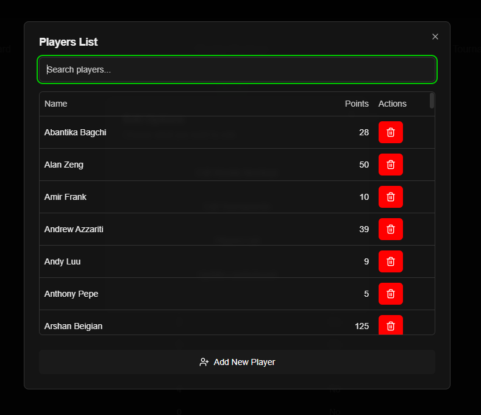
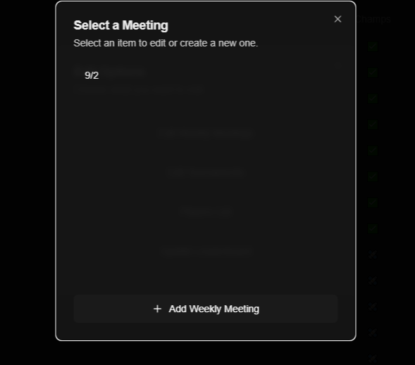

# Binghamton University Poker Club Website

Repository for the Binghamton University Poker Club's point tracking and tournament management system.
Designed with Next.js and shadcn

## Features

### Club Members
- **View Leaderboard**: Check standings and compare with other members.
- **View Meeting and Tournament Results**: See the where each player earned their points.

### E-Board Members
- **Manage Points**: Update points after tournaments or weekly meetings. Point calculations are done automatically and only need rank/knockout info.
- **Track Tournament Progression**: Create active tournament in which allows eboard members to input knockouts as the happen.

### Admin Panel

Everying in the admin panel is blocked behind a password so only authorized people can make adjustments to score.

### Player Autocomplete

Player names are automatically filled in as you type so you can ensure you are adding the points to the correct players.
Everywhere there is place to enter a name it uses this.
The player list button also give a option to add member to the database, so they become searchable.

### Weekly Meetings Settings

### Tournament Settings

### Tournament Dealers
Tournament Dealers get a special password to be able to enter knockouts as they happen.

